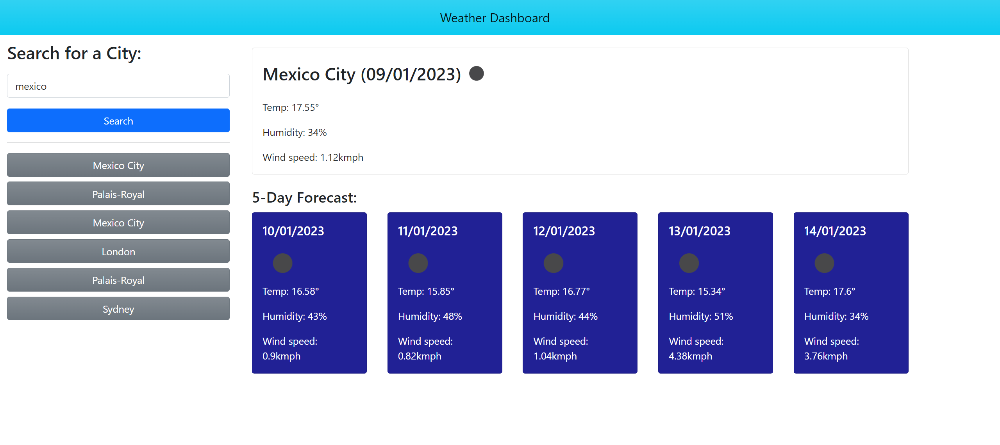

    # Weather Dashboard
Weather Dashboard! Built using HTML, CSS, Javascript and serverside API's.

## Description

This project is a weather dashboard. Users search for a city, and are presented with the current day's weather as well as a five day forecast. A history of past searches is displayed.

This project served as an opportunity to practice the implementation of serverside API's, DOM manipulation and algorithm design.

## Installation

The project can be accessed at: https://niktern.github.io/Weather-Dashboard-App/

## Usage

Type a city whose weather you would like to see into the searchbar. Then click the search button to see the weather for that city.

If an invalid input is given by the user, nothing will happen.

Upon successfully searching for a city, the city will appear below the searchbar as a button. This is the city history. Clicking on a historical search will pull up the weather for that city.

A bug exists in the API, which is discussed in the 'API-Bug-Notes' file.

## License

MIT License

Copyright (c) [2022] [NikolasTernezis]

Permission is hereby granted, free of charge, to any person obtaining a copy
of this software and associated documentation files (the "Software"), to deal
in the Software without restriction, including without limitation the rights
to use, copy, modify, merge, publish, distribute, sublicense, and/or sell
copies of the Software, and to permit persons to whom the Software is
furnished to do so, subject to the following conditions:

The above copyright notice and this permission notice shall be included in all
copies or substantial portions of the Software.

THE SOFTWARE IS PROVIDED "AS IS", WITHOUT WARRANTY OF ANY KIND, EXPRESS OR
IMPLIED, INCLUDING BUT NOT LIMITED TO THE WARRANTIES OF MERCHANTABILITY,
FITNESS FOR A PARTICULAR PURPOSE AND NONINFRINGEMENT. IN NO EVENT SHALL THE
AUTHORS OR COPYRIGHT HOLDERS BE LIABLE FOR ANY CLAIM, DAMAGES OR OTHER
LIABILITY, WHETHER IN AN ACTION OF CONTRACT, TORT OR OTHERWISE, ARISING FROM,
OUT OF OR IN CONNECTION WITH THE SOFTWARE OR THE USE OR OTHER DEALINGS IN THE
SOFTWARE.